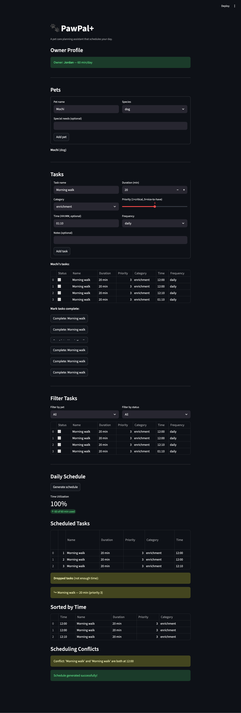

# PawPal+ (Module 2 Project)

**PawPal+** is a Streamlit app that helps pet owners plan and schedule daily care tasks for their pets.

## Features

- **Priority-based greedy scheduling** — Tasks are sorted by priority (1 = critical → 5 = nice-to-have) and packed into the owner's daily time budget. Critical tasks like medication always get scheduled first.
- **Chronological time sorting** — Tasks with an assigned time (HH:MM) are displayed in chronological order so owners can follow their day at a glance.
- **Task filtering by pet and status** — Filter the task list by pet name, completion status (pending/completed), or both to quickly find what you need.
- **Recurring task auto-renewal** — Daily and weekly tasks automatically create a new pending copy when marked complete, so recurring care never falls off the schedule.
- **Time conflict detection** — The scheduler warns when two or more tasks are booked at the same time, helping owners avoid double-booking.
- **Multi-pet support** — Manage tasks for multiple pets under one owner profile; the scheduler considers all pets when building the daily plan.

## Demo



## Getting Started

### Setup

```bash
python -m venv .venv
source .venv/bin/activate  # Windows: .venv\Scripts\activate
pip install -r requirements.txt
```

### Run the app

```bash
streamlit run app.py
```

### Run the tests

```bash
python -m pytest
```

### Run the demo script

```bash
python main.py
```

## Testing

The test suite includes 18 tests covering:

- **Mark complete** — verifies `mark_complete()` flips status to completed
- **Add task** — confirms adding a task increases the pet's task count
- **Sort by time** — checks chronological ordering with unscheduled tasks last
- **Recurrence** — ensures a daily task produces a new pending copy on completion
- **Conflict detection** — validates warnings when two tasks share the same time
- **Filtering** — tests filtering by pet name, by status, and by both combined
- **Pet with no tasks** — edge case: empty pet produces no conflicts and an empty plan
- **Three-way time conflict** — edge case: three tasks at the exact same time yield three pairwise warnings
- **Once-task returns None** — non-recurring task returns `None` from `mark_complete()`
- **All unscheduled sort** — sorting tasks that all lack a time works without error
- **Remove task** — removing by name decreases count; missing name returns `False`
- **Invalid category** — creating a Task with a bad category raises `ValueError`

## UML Diagram

See [pawpal_class_diagram.md](pawpal_class_diagram.md) for the full Mermaid class diagram, or `uml_final.png` for the exported image.

## Suggested Workflow

1. Read the scenario carefully and identify requirements and edge cases.
2. Draft a UML diagram (classes, attributes, methods, relationships).
3. Convert UML into Python class stubs (no logic yet).
4. Implement scheduling logic in small increments.
5. Add tests to verify key behaviors.
6. Connect your logic to the Streamlit UI in `app.py`.
7. Refine UML so it matches what you actually built.
