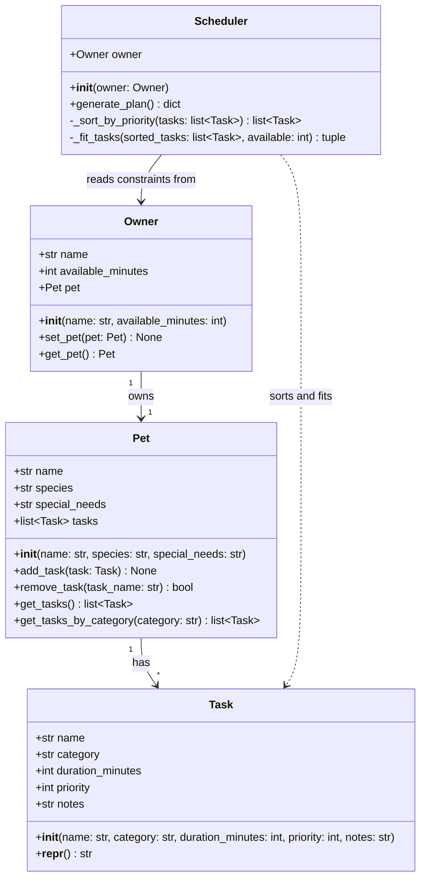

# PawPal+ Class Diagram

## Category values for Task

| Category    | Examples                        |
|-------------|---------------------------------|
| feeding     | Breakfast, dinner, treats       |
| exercise    | Morning walk, fetch, run        |
| medication  | Heartworm pill, eye drops       |
| grooming    | Brushing, nail trim, bath       |
| enrichment  | Puzzle toy, training session    |
| other       | Vet visit, travel               |

## Priority scale

| Value | Meaning       |
|-------|---------------|
| 1     | Critical      |
| 2     | High          |
| 3     | Medium        |
| 4     | Low           |
| 5     | Nice-to-have  |
